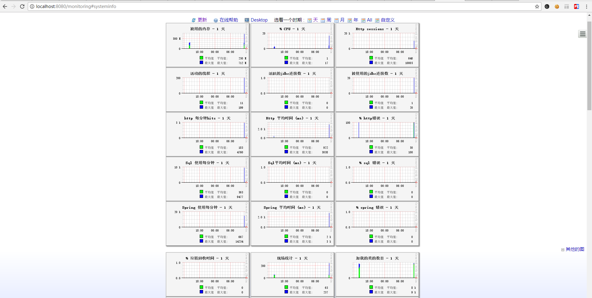
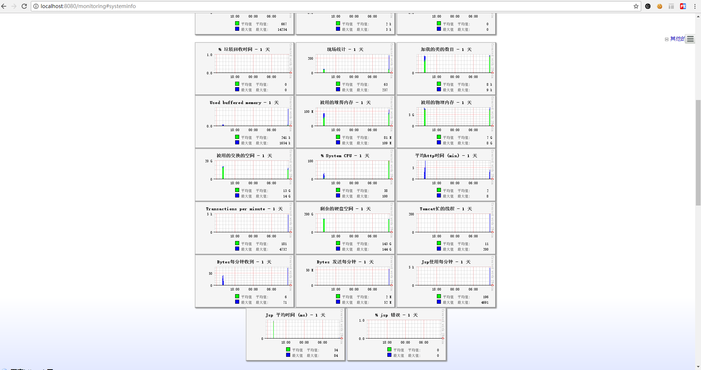
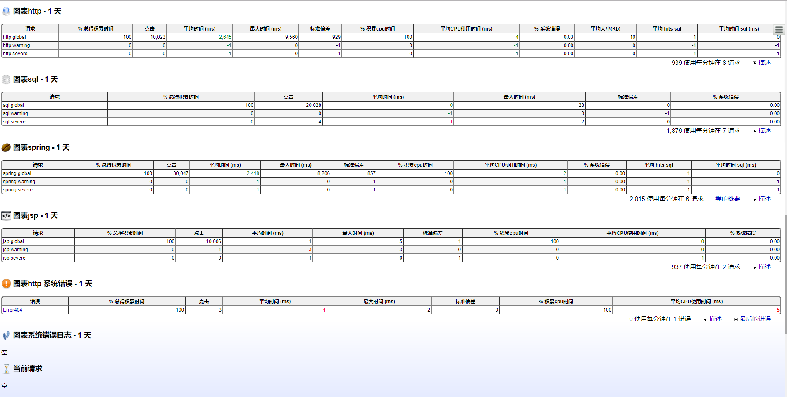
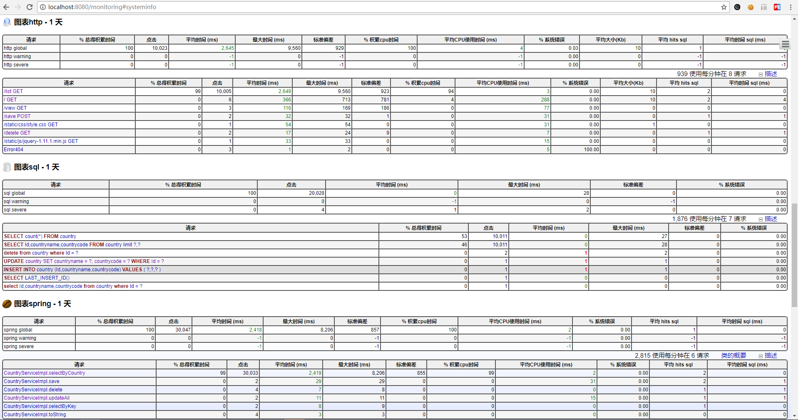
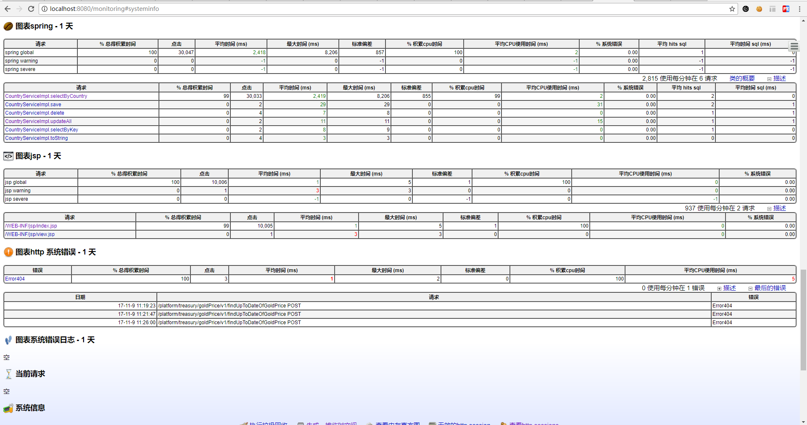
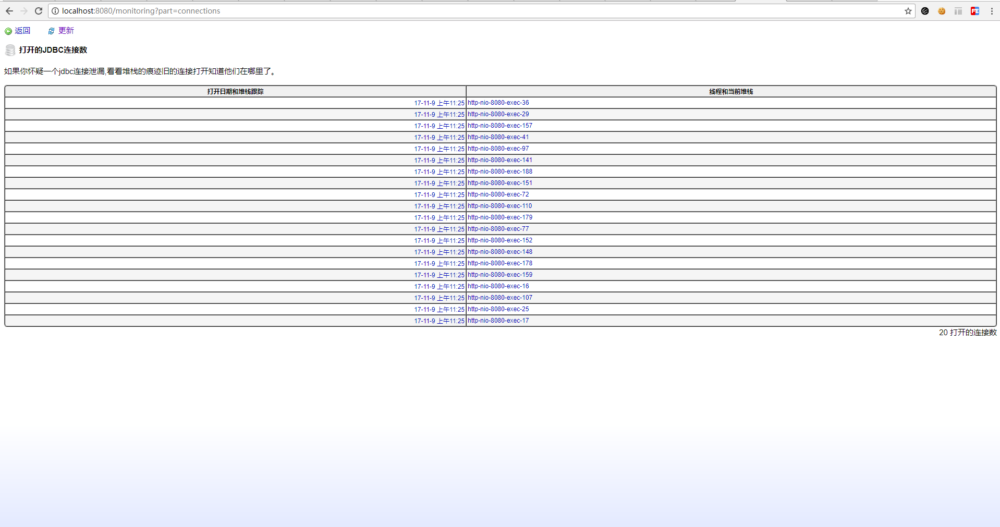
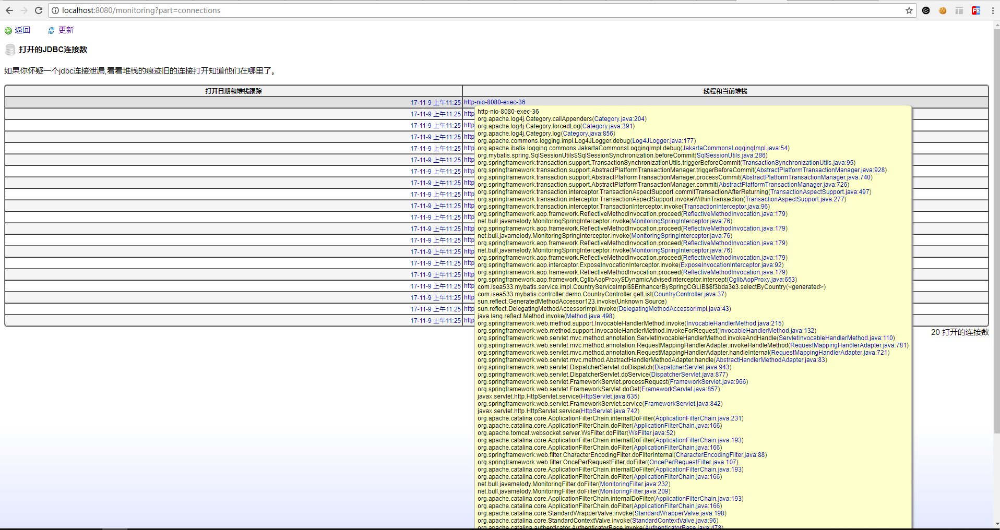
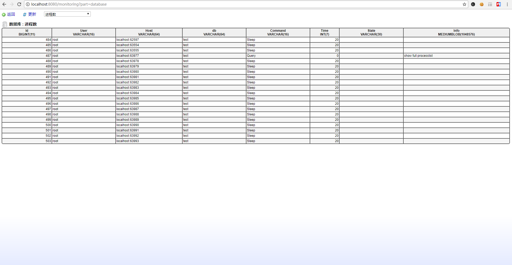
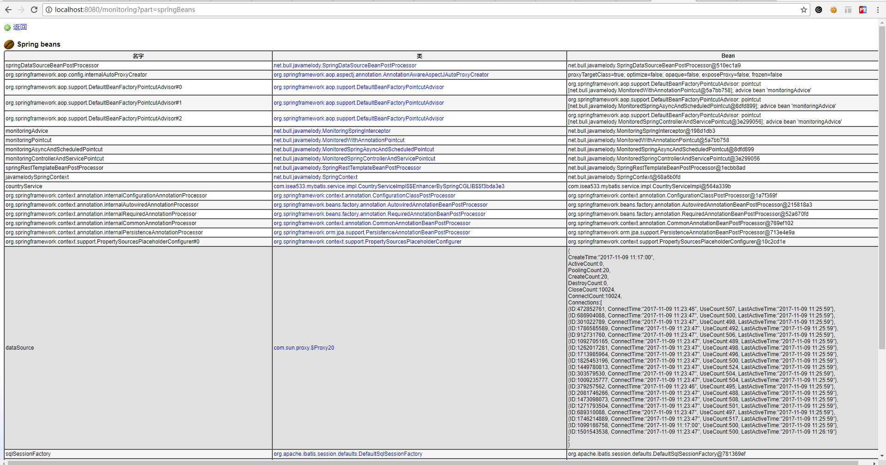

#简介
 JavaMelody-Simple-Demo 是使用 JavaMelody 监控 Java web 做性能分析的一个 Demo 项目主要目的是为了方便刚接触 JavaMelody 的童鞋能够快速上手，并且看到实际效果好做出决策是否使用该项目。
 
 - [JavaMelody](#https://github.com/javamelody/javamelody/wiki)  
 JavaMelody 是一个开源项目，他的目标是监控 测试 & 生产环境中的 Java 或 Java EE 应用程序。根据用户对应用程序的使用情况来衡量和计算应用程序实际操作统计信息的工具。
 
 - 首页图表统计效果图

 - 统计列表数据效果图

- JDBC 连接统计效果图

- DB 当前进程统计效果图

- Spring Bean 统计效果图 

